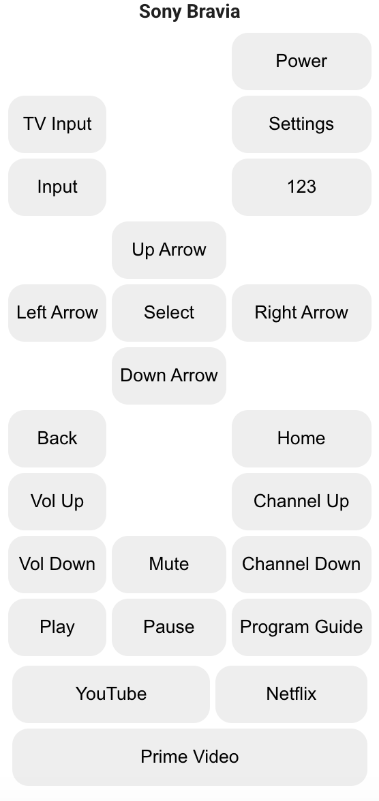
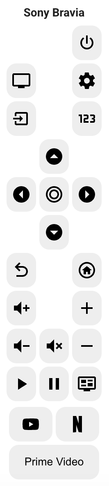
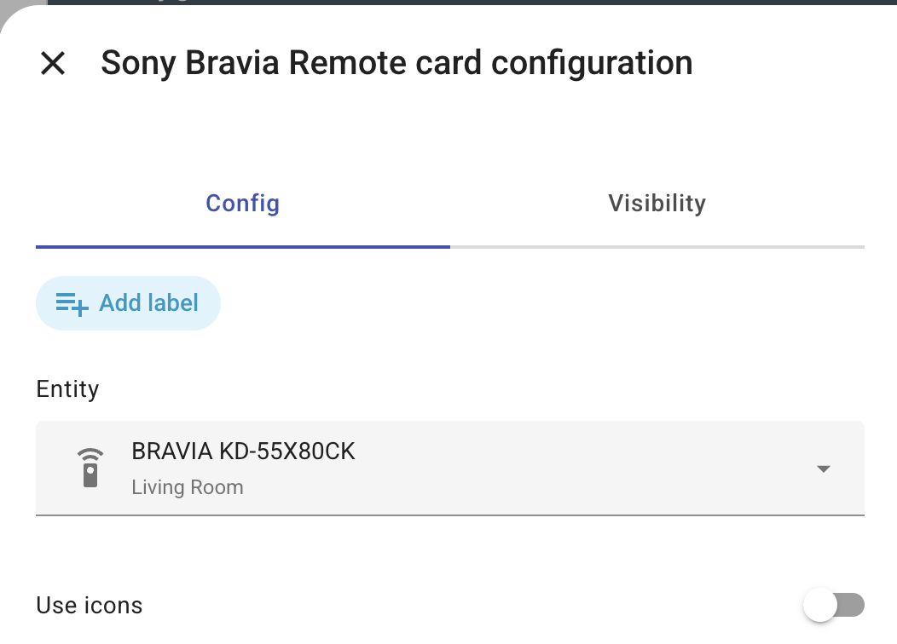

[![release][release-badge]][release-url]

# Sony Bravia Remote Control

## What is ha-sony-bravia-remote-card?
I was having issues where my Bravia TV wasn't correctly switing it's output to be my Sonos sound bar and I got tired of having to getup and dig out the remote so I could change the audio output. So I created this card to enable people to fully control their Sony Bravia TV. I have the KD-55X80CK but I suspect this will work with other models as well. 


### Features

- Layout mimics physical remote
- Full support HA UI Editor (no need to edit YAML code)

 

## Installation

### HACS

The Sony Bravia Remote Card currently requires you to add a custom repository in order to add the card to a dashboard. 

Use this link to directly go to the repository in HACS

[](https://my.home-assistant.io/redirect/hacs_repository/?owner=dlavey&repository=ha-sony-bravia-remote-card)

_or_

1. Install HACS if you don't have it already
2. Open HACS in Home Assistant
3. Click the three buttons at the top right and select Custom repositories
4. Enter "dlavey/ha-sony-bravia-remote-card" as the repository and Dashboard as the type
5. Click the ADD button
6. Search for "Sony Bravia Remote Card" and select the result
7. Click the download button

### Manual

1. Download the contents of the dist directory and place them in config/www
2. Go to Settings → Dashboards → Resources → Click Plus button → Set Url as /local/ha-sony-bravia-remote-card.js → Set Resource type as JavaScript Module.


## Usage

### UI Editor
The card can be fully configured from HA UI Editor.




### YAML configuration


|Name                 |Description                                                      |Required | Default     |
| ------------------- | ----------------------------------------------------------------| ------- | ----------- |
| `type`              | `custom:ha-sony-bravia-remote-card`                             | yes     |             | 
| `entity`            | Bravia remote control entity entity                             | yes     |             |
| `use_icons`         | When set to true, uses icons for the buttons rather than text.  | no      | false       |


Example:

```yaml
type: custom:sony-bravia-remote-card
entity: remote.bravia_kd_55x80ck
use_icons: false
```


<!-- Badges -->
[release-badge]: https://img.shields.io/github/v/release/dlavey/ha-sony-bravia-remote-card?style=flat-square


<!-- References -->
[hacs-url]: https://github.com/hacs/integration
[hacs]: https://hacs.xyz
[home-assistant]: https://www.home-assistant.io/
[release-url]: https://github.com/dlavey/ha-sony-bravia-remote-card/releases